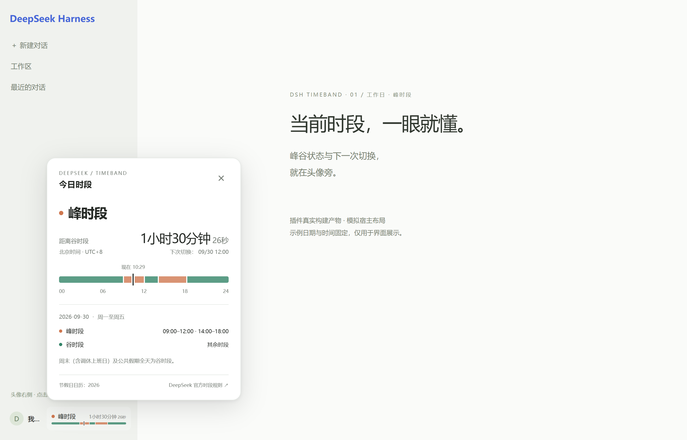
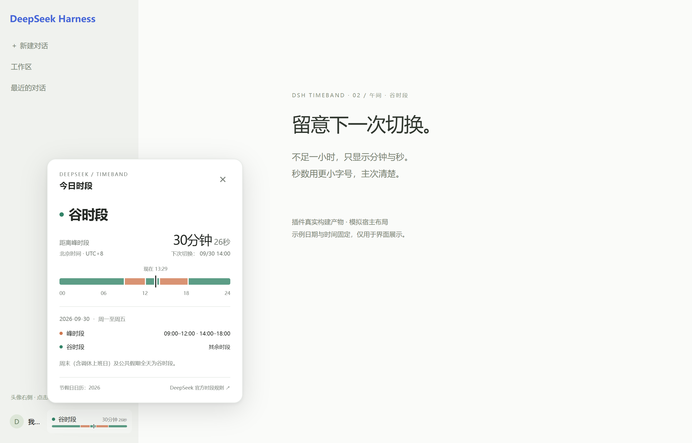
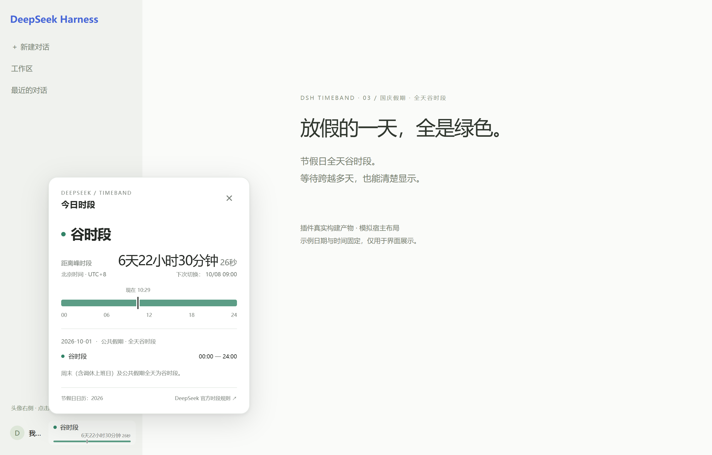
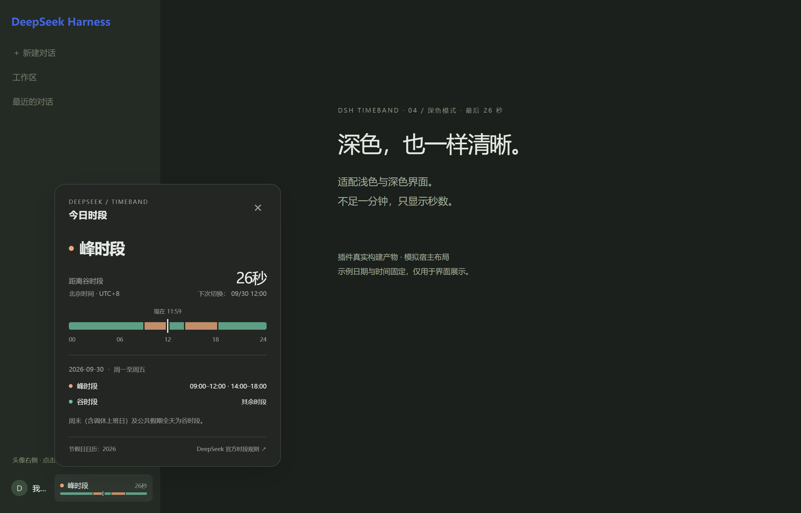

# DSH TimeBand

DeepSeek Harness 桌面端头像右侧的峰谷时段插件。状态、切换倒计时、迷你时间轴常驻；点击查看北京时间 24 小时时间轴。没有价格、消费金额、Token、余额或预计节省功能，也不读取账户或 API Key。

支持浅色 / 深色、中英文、侧栏折叠与节假日全天谷时段。离线运行，采用宿主共享的 React 和 Cordis 原生插件接口。

## 展示

以下截图使用插件真实构建产物，宿主布局和账户区域为模拟，日期与时间固定；不是实际桌面端截图。



<details>
<summary>午间谷时段：分钟与小字号秒数</summary>



</details>

<details>
<summary>国庆假期：全天绿色，跨天倒计时</summary>



</details>

<details>
<summary>深色模式：不足一分钟只显示秒</summary>



</details>

## 安装

已针对 **DeepSeek Harness 0.2.0-rc.2** 制作。版本声明只覆盖此版本，宿主升级后应重新验证并更新 peer 范围。

从 [GitHub Releases](https://github.com/a961282799-crypto/dsh-timeband/releases/tag/v1.0.1) 下载预构建安装包 `dsh-timeband-1.0.1.tgz`。不需要安装开发依赖或自行编译。

从托盘完全退出 Harness，在下载目录执行：

```powershell
dsh plugin --profile desktop add ./dsh-timeband-1.0.1.tgz
```

如果 `dsh` 不在 PATH，使用桌面端安装目录中随附的命令，例如：

```powershell
& 'C:\path\to\DeepSeek Harness\resources\runtime\cli\bin\dsh.cmd' plugin --profile desktop add ./dsh-timeband-1.0.1.tgz
```

安装后重新打开 Harness，侧栏底部即可看到插件。卸载：

```powershell
dsh plugin --profile desktop remove dsh-timeband
```

### 从源码打包

```powershell
npm ci
npm run build
npm pack --pack-destination artifacts
```

先从托盘完全退出 Harness，再在本目录执行：

```powershell
powershell -NoProfile -ExecutionPolicy Bypass -File .\scripts\install-desktop.ps1
```

脚本默认使用 PATH 中的 `dsh`，也可传入 `-DshCommand` 指定随附 `dsh.cmd` 的完整路径。脚本通过官方 CLI 安装，不修改应用文件；如应用仍运行会停止并提示退出，不强制结束进程。重新打开 Harness 后生效。

Web 版可改成 `--profile web`，组件显示在侧栏底部原生插槽。

## 界面与兼容边界

- 桌面端侧栏展开：头像右侧显示时段、倒计时和今日迷你时间轴。倒计时按剩余时间显示「天、小时、分钟」，秒以较小字号跟随；不足一天省略天，不足一小时只显示分钟和秒，不足一分钟只显示秒。
- 侧栏收起：紧凑图标和状态点；点击仍可查看完整卡片。
- 原生 Popover 提供顶层显示、外部点击关闭；Escape 关闭并回到触发按钮。卡片会限制在窗口内，支持中英文与宿主颜色变量。
- 头像右侧没有独立的官方插槽。插件注册到 `sidebar.footer.action`，以带严格结构条件的 CSS 调整 rc.2 的两个底部容器，保留原头像按钮及其事件。若同一插槽有其他插件或宿主布局不匹配，保留原生上下排列，不强行修改 DOM。
- 当前信息只表示 **DeepSeek 官方 API 的时间规则**；第三方中转服务是否采用这些规则由其自行决定。

## 规则与日历

2026-09-30 核实：[DeepSeek 官方定价说明](https://api-docs.deepseek.com/quick_start/pricing/)。北京时间周一至周五 09:00–12:00、14:00–18:00 为峰时段，开始包含、结束不包含；其他时间为谷时段。周末即使是调休上班日也保持谷时段。

`src/calendar.ts` 内置 2026 年公共假期，取自[国务院办公厅通知的政府转载](https://www.lufengshi.gov.cn/swlfsjj/gkmlpt/content/1/1199/mpost_1199727.html)，覆盖完整放假区间。新年份需要按当年公告更新此文件的 `years`、`holidays` 和 `verifiedOn`，同时更新界面日历覆盖文案。

未收录年份的工作日峰时段显示「待核实」，不推断假日。倒计时遇到未知日历区间会停止给出确定峰谷切换时间。插件离线运行，不自动抓网页、联网更新或收集数据。

## 架构

TypeScript 7 + React 18（宿主共享实例）+ Cordis 官方插槽生命周期；esbuild 生成 DSH 的 `__ModuleLoader__.load({ id, factory })` 格式。发布包没有运行时 npm 依赖，也不打包另一份 React。

`src/schedule.ts` 是纯时间逻辑；`calendar.ts` 是带来源的日历；`clock.ts` 是单一可订阅时钟，隐藏时暂停，唤醒时重读系统时间；`client.ts` 持有注册、字典、样式及清理；`view.tsx` 只接收宿主注入的时钟和翻译函数。`cordis.patch.yml` 与 `dsh.bundle` 负责安装后进入宿主配置。

接口依据：[官方 Client Slots](https://deepseek-harness.github.io/deepseek-harness/en/reference/subsystems/slots)、npm 发布的 `0.2.0-rc.2` 类型与 SlotRegistry；源码布局参照上游提交 `639ed015397290b3745d163aafe02ffee4aa3f84`。不承诺未测试版本兼容。

## 开发与验证

```powershell
npm ci
npm run check
npm run preview
npm pack --pack-destination artifacts
```

浏览器测试使用本机 Chrome。预览地址 `http://127.0.0.1:4173`，支持切换普通工作日、国庆、调休周六和未知年份。预览加载真实构建产物，宿主布局和账户按钮为模拟，时间固定用于检查。

预览运行时，在另一个终端执行 `npm run screenshots`，可重建 `docs/images/` 中的四张展示截图。

测试覆盖四个毫秒级切换边界、2026 全年时间轴一致性、多日假期、时区、跨年未知日历、休眠恢复和清理；使用真实 rc.2 Cordis/SlotRegistry 验证延迟插槽声明、移除重建及卸载；Chrome 检查头像右侧排列、弹层、键盘、外部关闭、窄窗口、中英文与浅深色截图。

当前验证：类型检查、9 项 Node 测试、7 项 Chrome 测试通过；官方桌面 CLI 安装、bundle 启用与安装产物一致性已验证。独立预览和注册器测试不等同于完整桌面端界面验收。

## 许可证

[MIT](LICENSE)
